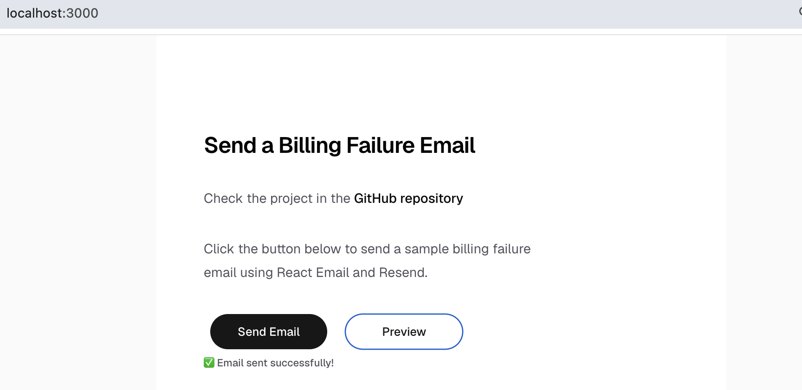
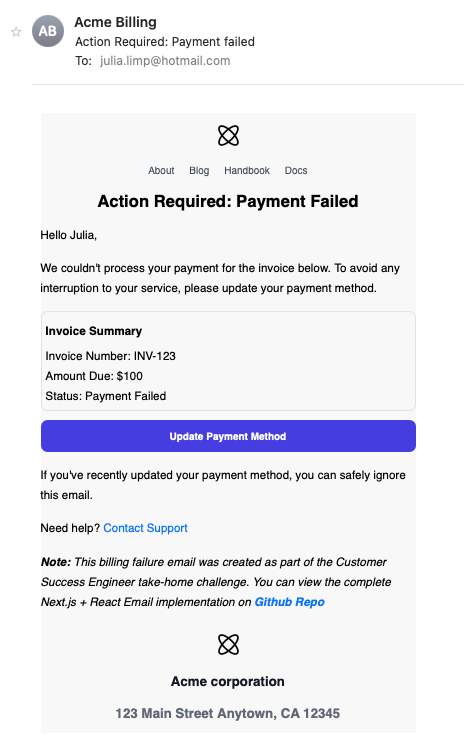

# Send a Billing Failure Email with React Email and Resend

**Repository:** [billing-failure-email-resend](https://github.com/julialimp/billing-failure-email-resend)

This tutorial demonstrates how to build and send a transactional billing failure email using Next.js, React Email, and Resend.

By the end of this guide, you will have:

- A React Email template for a billing failure notification
- A Next.js API route that sends emails through Resend
- A PDF invoice attachment
- A local preview page (`/preview`)
- A simple UI for triggering the email locally

The finished application includes a simple web interface for triggering the email, a reusable React Email template, and a local preview page for iterating on the design during development.

## Why React Email and Resend?

React Email allows you to create email templates using reusable React components instead of manually writing HTML.

Resend handles email delivery through a simple API, allowing your application to send transactional emails reliably.

In this example:

- React Email is responsible for the email design.
- Next.js handles the server-side email sending logic.
- Resend delivers the email.

## Prerequisites

- Node.js
- A Resend account
- A Resend API key

## Tutorial Steps

### 1. Create a Next.js project

```bash
npx create-next-app@latest
```

We will use Next.js because it provides an API route that can securely communicate with Resend.

### 2. Install the required dependencies

```bash
npm install resend
npm install @react-email/components react-email
```

### 3. Configure Resend API key

- Create an account at [Resend](https://resend.com)
- Navigate to [API Keys](https://resend.com/api-keys) and create a new API Key
- Store the API Key in a local environment (`.env.local`) variable called `RESEND_API_KEY`

The API key should never be exposed in client-side code. Store it as an environment variable and access it only from server-side code.

### 4. Create the email template

Add a folder `emails` to the root of the project and create the email template

```ts theme={"theme":{"light":"github-light","dark":"vesper"}}
export function BillingFailureEmail({name,}: { name: string;}) {
  return (
    <Html>
      <Body>
        <Container style={{ margin: 15, backgroundColor: "#f9f9f9" }}>
          <EmailHeader />
          <Heading>
            Action Required: Payment Failed
          </Heading>
          <Text>Hello {name},</Text>
          <Text>
            We couldn't process your payment for the invoice below. To avoid any
            interruption to your service, please update your payment method.
          </Text>
          <EmailFooter />
        </Container>
      </Body>
    </Html>
  );
}
```

Keeping email templates separate from delivery logic makes them easier to reuse, test, and maintain as your application grows.

Email-specific reusable components live in `components/`, while complete email templates live in `emails/`. This separation keeps the email structure organized as more templates are added.

### 5. Create React Email components

React Email provides pre-built components that make it easier to create email-compatible layouts.

For this example, we will create reusable header and footer components and compose them into the billing failure email.

For this project, we created reusable `EmailHeader` and `EmailFooter` components and imported them into `emails/BillingFailureEmail.tsx`.

```ts theme={"theme":{"light":"github-light","dark":"vesper"}}
import { EmailHeader } from "@/components/EmailHeader";
import { EmailFooter } from "@/components/EmailFooter";
```

### 6. Create the sending endpoint

Create a new folder `app/api/send/route.ts`

**Initialize the Client**

```ts theme={"theme":{"light":"github-light","dark":"vesper"}}
import { Resend } from "resend";

const resend = new Resend(process.env.RESEND_API_KEY);
```

**Import the BillingFailureEmail template**

```ts theme={"theme":{"light":"github-light","dark":"vesper"}}
import { BillingFailureEmail } from "@/emails/BillingFailureEmail";
```

#### Add an attachment

Resend supports file attachments through the `attachments` option.

In this example, we read a sample invoice PDF from the `attachments` folder and include it with the email.

```ts theme={"theme":{"light":"github-light","dark":"vesper"}}
import fs from "fs";
import path from "path";

const invoicePath = path.join(process.cwd(), "attachments", "invoice.pdf");

const invoiceBuffer = fs.readFileSync(invoicePath);
```

**Send an Email**

```ts theme={"theme":{"light":"github-light","dark":"vesper"}}
const { data, error } = await resend.emails.send({
  from: "Acme Billing <onboarding@resend.dev>",
  to: ["youremail@domain.com"],
  subject: "Action Required: Payment failed",
  react: BillingFailureEmail({ name: "Julia" }),
  attachments: [
    {
      filename: "invoice.pdf",
      content: invoiceBuffer,
    },
  ],
});

if (error) {
  console.error("Error sending email:", error);
  return new Response("Error sending email", { status: 500 });
}
console.log(data);
return new Response("Email sent successfully", { status: 200 });
```

### 7. Add UI Trigger

For this demo, we will add a simple button that calls the API route responsible for sending the email.

Create a client component:

```ts
"use client";

export function SendEmailButton() {
  async function handleClick() {
    await fetch("/api/send");
  }

  return (
    <button onClick={handleClick}>
      Send Email
    </button>
  );
}
```

Import the component into `app/page.tsx`:

```ts
import { SendEmailButton } from "@/components/SendEmailButton";

<SendEmailButton />
```

This allows anyone running the project locally to trigger the email without manually calling the API endpoint.

### 8. Preview and Send

Start the development server:

```bash
npm run dev
# or
yarn dev
# or
pnpm dev
# or
bun dev
```

#### Previewing the email locally

During development, it is useful to preview email templates without sending them.

This project includes a preview page available at: `http://localhost:3000/preview`

The preview page renders the React Email component directly, allowing you to iterate on the design without repeatedly sending test emails.

#### Sending email

To send the email, click the "Send Email" button on the homepage. This will trigger the `/api/send` route, which uses the Resend API to deliver the billing failure email with the attached invoice.

#### Simple Home Page with button to trigger and preview email



#### This is how the finished email will look like



## Run this project locally

### 1. Clone the repository

```bash
git clone https://github.com/julialimp/billing-failure-email-resend.git
cd billing-failure-email-resend
```

### 2. Install dependencies

```bash
npm install
```

### 3. Create your environment variables

Create a `.env.local` file in the project root:

```env
RESEND_API_KEY=re_your_api_key_here
```

> You can generate an API key from your Resend dashboard: [Create and store your API Key](#3-create-and-store-your-api-key)

### 4. Customize the email

Before running the project, you can update the sample email values in `app/api/send/route.ts`:

- Sender email (`from`)
- Recipient email (`to`)
- Customer name
- Invoice amount
- Invoice number

Example:

```ts
from: "Acme Billing <onboarding@resend.dev>",
to: ["your-email@example.com"],
```

### 5. Start the development server

```bash
npm run dev
# or
yarn dev
# or
pnpm dev
# or
bun dev
```

Open [http://localhost:3000](http://localhost:3000) with your browser to see the result.


## Final considerations

This example uses placeholder values for demonstration purposes.

In a production application:

- Use a verified sending domain instead of `onboarding@resend.dev`
- Replace placeholder URLs with real billing and support endpoints
- Handle retries and failures appropriately
- Monitor delivery events and email reputation
- Respect Resend rate limits:
  - The default rate limit is 10 requests per second per team. If you exceed the rate limit, you'll receive a `429` response error code. If needed, you can request a rate increase by [contacting support](https://resend.com/contact).

Thank you for taking the time to review this project.